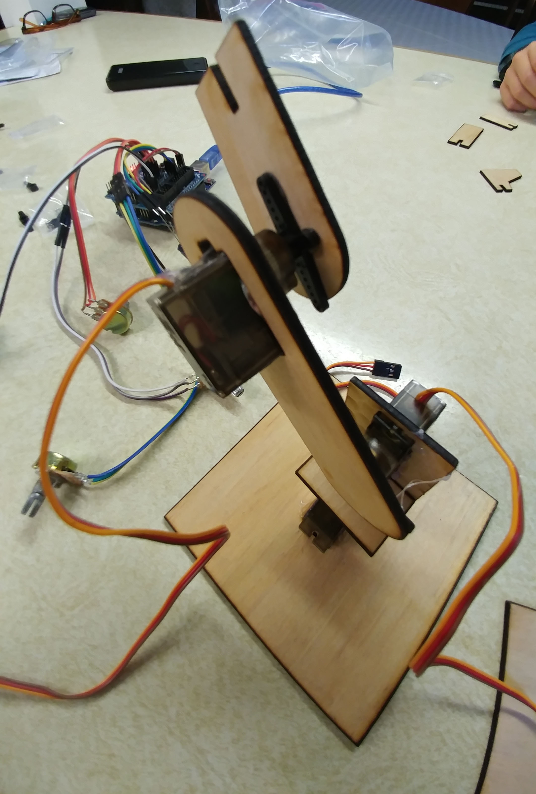
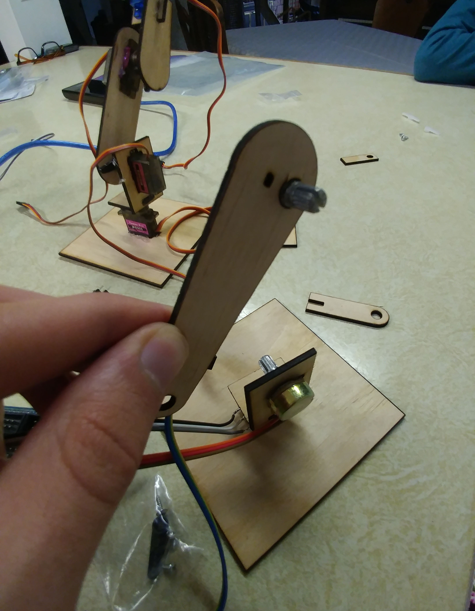

# Assembly instructions

For glue hot glue works well.

Servo horns are the things you put on servos. Friction fit is probably enough but optionally you can screw them on or use a little hot glue. 

Center each servo before permanently connecting a servo horm. Just turn them to figure out their range and turn it to the center, or use a servo tester or receiver or something to have the servo center itself.

## Step 1

Take inventory. Left side is the servo arm, right is the control arm.

---

## Step 2

Servo arm first. Glue these.

---

## Step 3

Glue in the base servo. Put a servo horn on the servo. Glue the part 2 part on top.

---

## Step 4

Glue in the elbow servo with the turning part up.

---

## Step 5

Carefully glue the grabber servo into the grabber servo mount with the wire facing forward and the slots on the right.

---

## Step 6

Glue in the wrist servo with the turning part towards the end.

---

## Step 7

Glue the arm part onto the elbow servo.

---

## Step 8

Glue the first wrist part onto the wrist servo with the 90deg corner on top and the slightly wider angle corner on the bottom.

---

## Step 9

Slide the grabber servo mount onto the first wrist part. Glue if needed.

---

## Step 10

Slide the grabber "hand" onto the grabber servo holder.

---

## Step 11

Slide together the grabber "thumb" pieces and glue them onto the grabber servo. Made sure the end of the hand and thumb line up.

---

## Step 12

Next the controller arm. First *solder wires to the potentiometers*. I just stripped one end of some jumper wires and soldered them on. Jumper wires are nice because they are stuck together and are easy to extend by plugging more wires onto the first ones.

Press or glue a potentiometer (aka pot) into the base.

---

## Step 13

Center the pot and press the next piece on as shown.

---

## Step 14

Press the elbow pot on in the orientation shown.

---

## Step 15

Glue that to the base.

---

## Step 16

Press the wrist pot onto the arm piece and press the arm onto the elbow pot.

---

## Step 17

Press the wrist piece onto the wrist pot and slide the grabber pot holder onto the wrist piece.

---

## Step 18

Press the grabber pot onto the holder piece and press the grabber controller piece onto the pot.

---

## Step 19

Add extension wires as needed.

---

## Step 20

Connect everything to the arduino. In the example code I have the servos connected to pins 8,9,10,11 starting with the base servo. The potentiometers are connected to a5,a4,a3,a2 starting with the base pot.

It is easiest to use a sensor shield on the arduino. The sensor shield has G, V, and S rows. On the servos, made sure the orange wire goes into the S row of pins. 

The middle pin on the pots should be connected to the "S" row. The other two pins can be connected either way. Switching them reverses the pot.

---

## Step 21

Upload the example arduino sketch.

## Step 22

Next we need to calibrate it so the controller and arm move together. The sketch can be modified to do this, or the easier way is to turn on the arm and remove and replace each joint on the controller arm so that it matches the servo arm. If the joint turnes the wrong way, switch the G and V pins of that pot.

Good luck!

